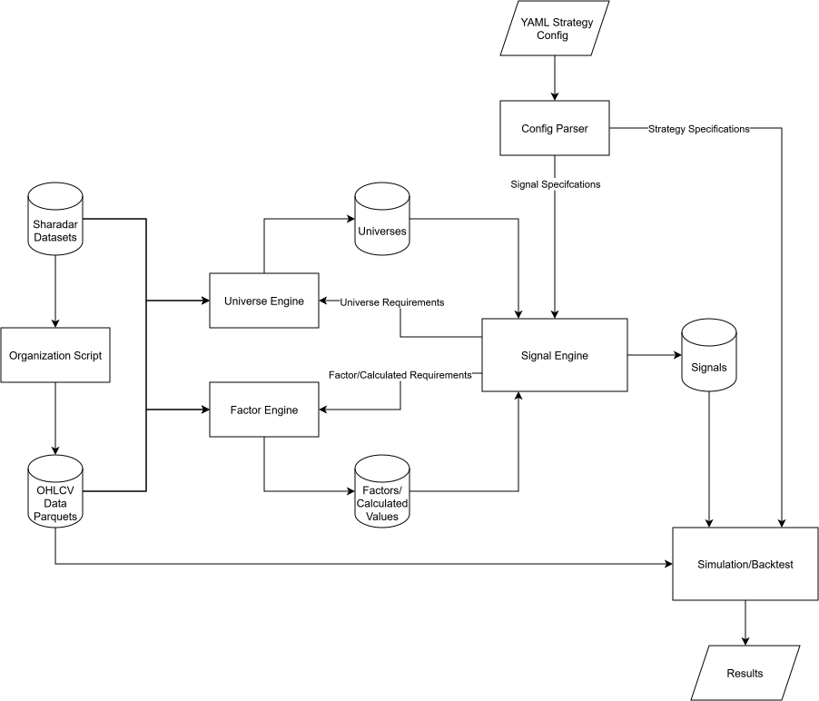

# TradingResearchBetaV2

## Introduction
This repository represents a few months of my personal efforts in development, research, and learning in the quantitative trading space. The goal of this was to see if there is a [alpha](https://www.investopedia.com/terms/a/alpha.asp) (excess return) that I can utilize in market phenomena known as [factors](https://www.investopedia.com/terms/f/factor-investing.asp), where I primarily researched momentum and value. I have found several models through my research here that do generate alpha (specifically some variants of momentum + value + low volatility portfolios), however, that does **NOT** mean I have discovered something new. The existence of these factors has been known and researched for decades ([Fama-French](https://en.wikipedia.org/wiki/Fama%E2%80%93French_three-factor_model), [Jegadeesh and Titman](https://www.bauer.uh.edu/rsusmel/phd/jegadeesh-titman93.pdf), [Moskowitz](https://www.sciencedirect.com/science/article/pii/S0304405X16301490), etc.). Many notable hedge funds design strategies around them (most prominently [AQR](https://www.aqr.com/), which was a major inspiration for getting me into quantitative trading) and offer funds or ETFs to the public.

This repository is **NOT** functional. I have redacted data (due to [Terms of Use](https://sharadar.com/terms)), so any functionality from cloning will simply not work. I am more than happy to walk through things and provide a demo. The core idea around this project is to hold sets of rolling portfolios (cohorts). For example, 6 month cohorts means I would hold individual portfolios for 6 months, sell them, and reconstruct a new portfolio the day after selling.

I **strongly** recommend reading PROJECT_CONTEXT.md which gives insight into what I was generally doing and how (structure and limited research results), it is an auxiliary document that I give to Claude in addition to CLAUDE.md.

## Features

- Polars and parquet usage to conduct simulations in a memory-efficient manner for low-memory machines
- Multi-portfolio orchestration and coordination via MasterPortfolio and Portfolio classes
- Factor library: A set of scripts that generate calculated "factors" (I bundled the idea with some non-factors such as volatility)
- Signal generation and ranking with the option to combine factors
- Config-driven strategy definition via YAML
- NAV accounting
- Slippage modeling
- Universe filtering

## Why is X Missing?

**Data:** As stated prior, I have had to purge data from the repository (see there is no git history) to comply with [Terms of Use](https://sharadar.com/terms) for the data provider I used, Sharadar. Unfortunately, this means nothing can be tested (unless my data setup is replicated), but I am more than happy to demo. I am considering displaying the way I conducted storage but populating the parquet files with random data to communicate my structure and remain compliant.

**Ingestion of Data:** My data was sourced from [Sharadar](https://data.nasdaq.com/publishers/SHARADAR), which has an API to help retrieve data. However, I found no use for it as it is a subscription service which I did not want to have for multiple months due to costs, therefore I downloaded all the data at once (spread throughout a couple CSVs), then made scripts to organize said data. Sharadar only provides data on the daily horizon (and even less frequently for fundamentals), so although the approach was crude it was suitable for me.

**Test Coverage:** The core logic of this project revolves around Portfolio and MasterPortfolio, which have tests in Tests/. I do not have comprehensive testing across the rest of the codebase due to me seeing the other components as having lower risk. I have opted to tolerate those risks, as I am the only intended user.

**Real Trading Architecture:** As stated prior, I have found models that produced alpha (~3% relative to SPY, not listed in the PROJECT_CONTEXT.md), but aren't practically worth trading. The best performing model was from a mix of strategies that held cohorts for 6 months, which would be subject to short-term capital gains tax that would eat away at any alpha. There is no motivation for me to trade that model when practically equivalent or even better investment vehicles/blends, primarily ETFs (such as MTUM, VFMF, SPMO, IVAL), are based around a similar set of factors. I can instead hold them until I get long-term capital gains tax. That is not to say I am done with quantitative trading, quite the opposite, my next step is to take all of what I have learned here and research with intraday data (which current infrastructure does not support) with other data sources, such as options to better capture idiosyncratic risk, to develop a strategy that is worth trading practically.

## Notes
**AI Usage:** AI (specifically Claude) was used in this project as a coding partner, almost all comments, docstrings, and formatting were AI-generated. I was quite keen on learning, so my workflow involved me researching and designing every component myself, implementing the first few iterations, then using AI to review, debug, and refine (find bugs, point out edge cases, add logging, alternative and/or optimized structure). Core logic, architecture, and research methodology decisions were my own.

**Recency of Changes:** I did not start using version control until I was practically "done" with the project. My initial commit was after ~2 months of working (late 2025) as I believed I had no use for it. The project is interconnected, so I found that there was no meaningful checkpoint to commit until most components existed together. After the initial commit, I rapidly deployed and tested ideas, accelerated with the use of AI. Specifically, trying to explore stochastic processes, derivatives, and Bayesian inference. However, my knowledge was and is too shallow, so I have halted these efforts until I can actually grasp what I am trying to research.
